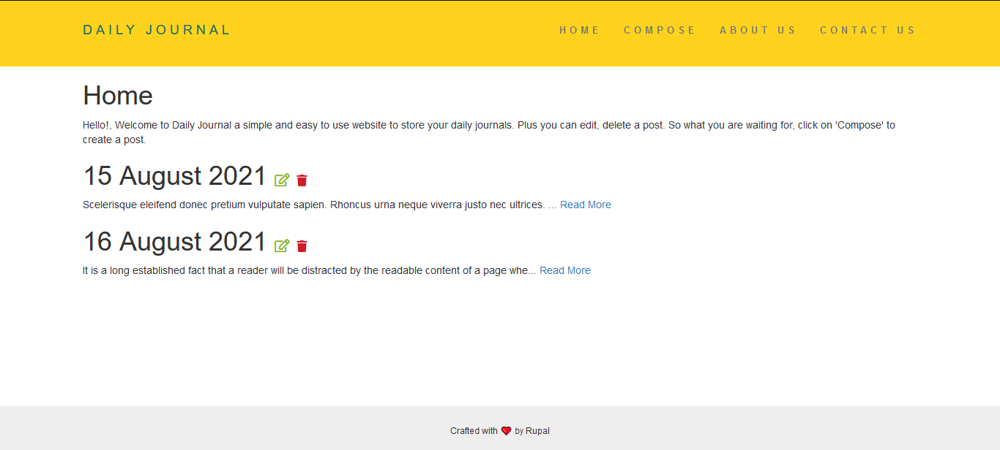
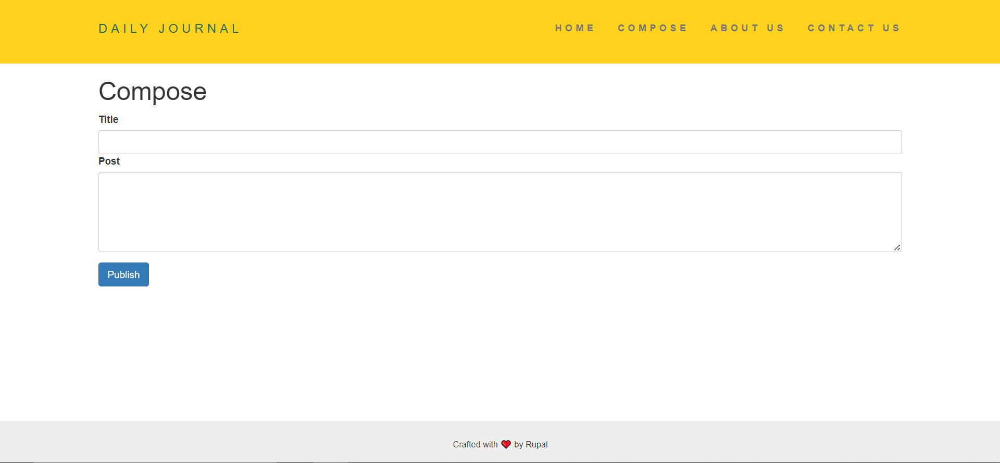
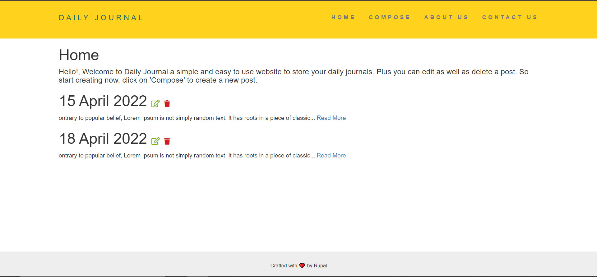

# Journal

-	Web application designed and developed using backend **NodeJs, ExpressJs and MongoDB.**
-	User can compose, edit and delete a  post.
-	Used **HTML, CSS, JavaScript, EJS** to implement front-end.    

### [Go to Website!](https://journal01.herokuapp.com/)

  

### Images
---

Journal Home Page(before)

Journal Home Page(before)

Journal Home Page(before)

 ----